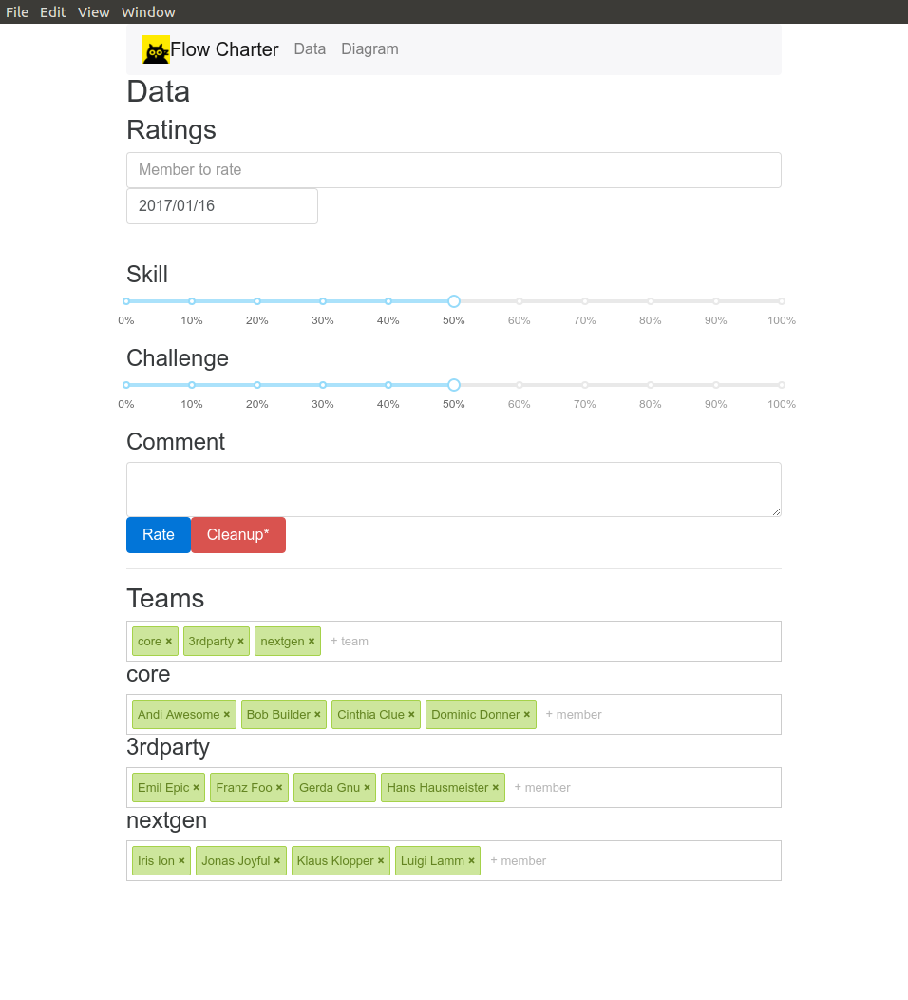
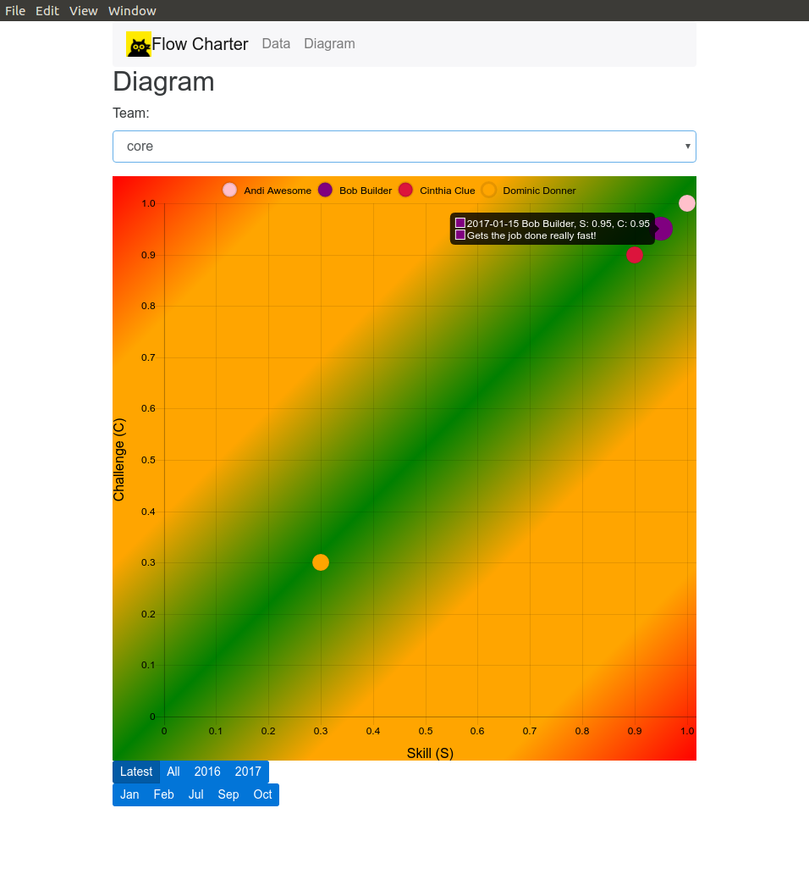
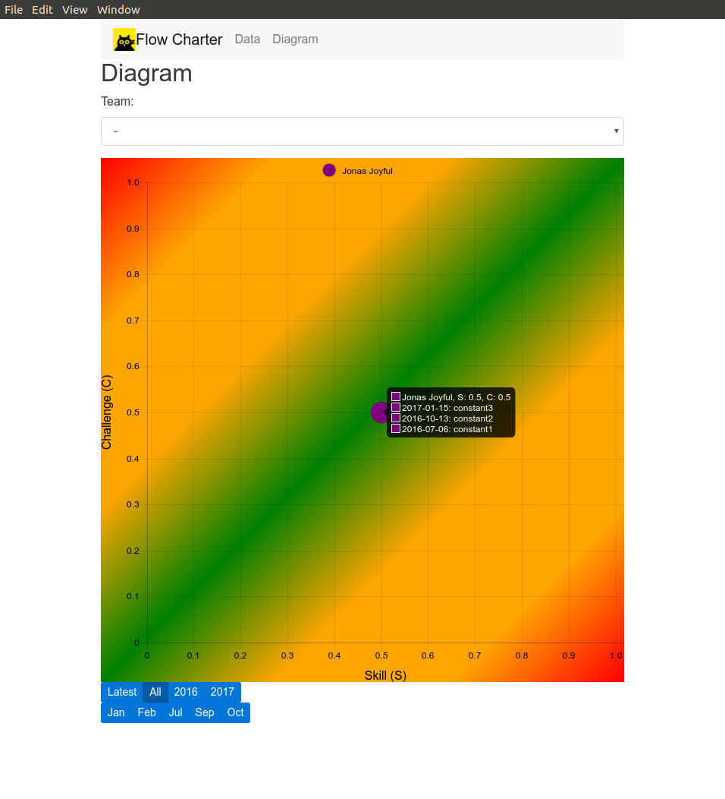

# Flow Charter





## Development

```bash
# Install dependencies
npm install

# Run the app
make dev
```

## Packaging

1. Install `electron-packager`

```bash
npm install -g electron-packager
```

2. Run make in the `flow-charter` directory:

```bash
make
```

## License

Not licensed yet.
